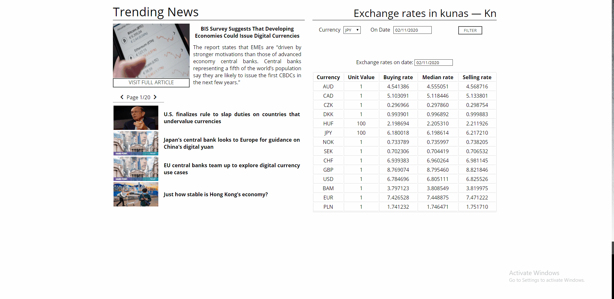

App with Croatian Kuna rates and trending news related to currencies and banks.
You can filter other currencies by currency and date and get exchange rates.
It has data visualization for buying , selling and median rates.
Two different APIs are used, one for news and other for exchange rates.

##APIs used

News API : https://newsapi.org/
HNB exchange lookup api: http://hnbex.eu/api/v1/
